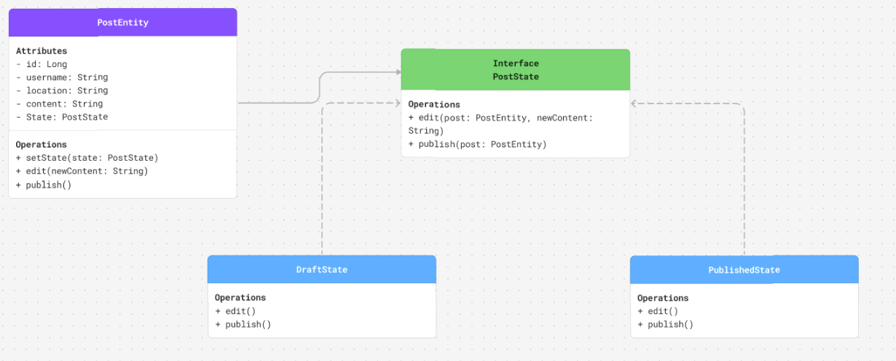

## Implementation
# What Was Implemented
For PM4, we implemented one interface and 3 classes. Our interface is PostState and it defines two operations: edit() and publish(). These methods are then implemented into two class titled DraftState and PublishedState. DraftState is a post still in its draft whereas PublishedState is a post that has been published. Finally, the PostEntity class is where the posts attributes live including the username, id, location, contents, and state of the current post.

UML Diagram of Classes:

# How It Was Implemented
It was implemented through vocal collaboration discussing different ideas on what to implement. Once we had the diagram, we each separately created one class/interface.

# Relating to Overall System Design
It relates to our overall system design because we used seperate classes and interfaces for the component of a post for our project. To create our entire project, we would follow the same design of having separate classes and interfaces to develop each component of our app.